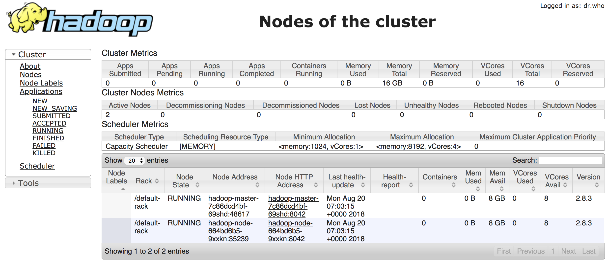

# k8s hadoop simple cluster

use image [izone/hadoop](https://hub.docker.com/r/izone/hadoop/)

cluster/cluster.sh [origin](https://github.com/luvres/hadoop/blob/master/cluster/cluster.sh)

datanode/start.sh [origin](https://github.com/luvres/hadoop/blob/master/cluster/datanode/start.sh)

## build images

### datanode

cd ../datanode

docker build -t hadoop:2.8.3-datanode ./

### namenode

cd cluster.sh

docker build -t hadoop:2.8.3-cluster ./

## deploy

datanode must have started before deploy namenode(namenode ssh datanode to config)

### datanode

kubectl apply -f deploy-datanode.yml

### namenode

kubectl apply -f deploy-namenode.yml

## show

```bash
$ kubectl get pods
NAME                                        READY     STATUS        RESTARTS   AGE
hadoop-master-7c86dcd4bf-69shd              1/1       Running       0          2d
hadoop-node-664bd6b5-9xxkn                  1/1       Running       0          2d


$ kubectl get svc
NAME                    TYPE        CLUSTER-IP      EXTERNAL-IP   PORT(S)                                                                                                                                        AGE
hadoop-master           NodePort    10.108.140.65   <none>        22:8424/TCP,8088:8388/TCP,8042:8342/TCP,50070:8418/TCP,8888:8488/TCP,4040:8340/TCP,8787:8387/TCP,9000:8305/TCP,60010:8464/TCP,60030:8348/TCP   2d
hadoop-node             ClusterIP   10.96.224.246   <none>        22/TCP

```

