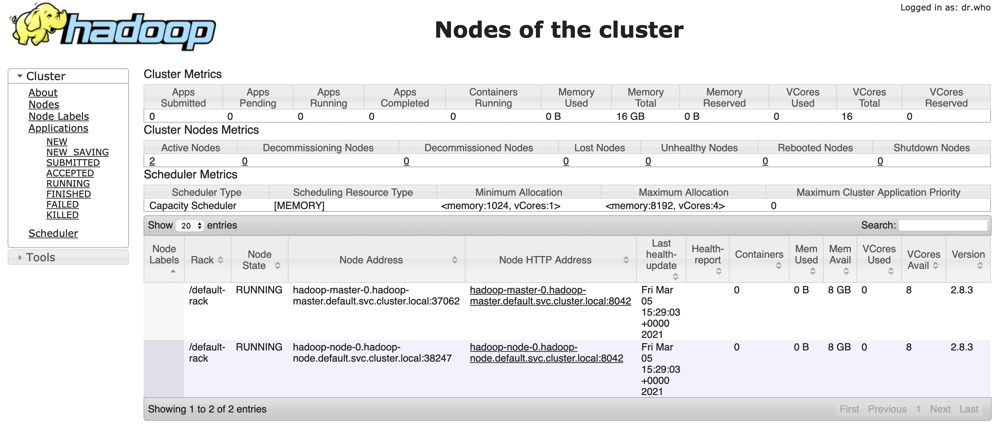
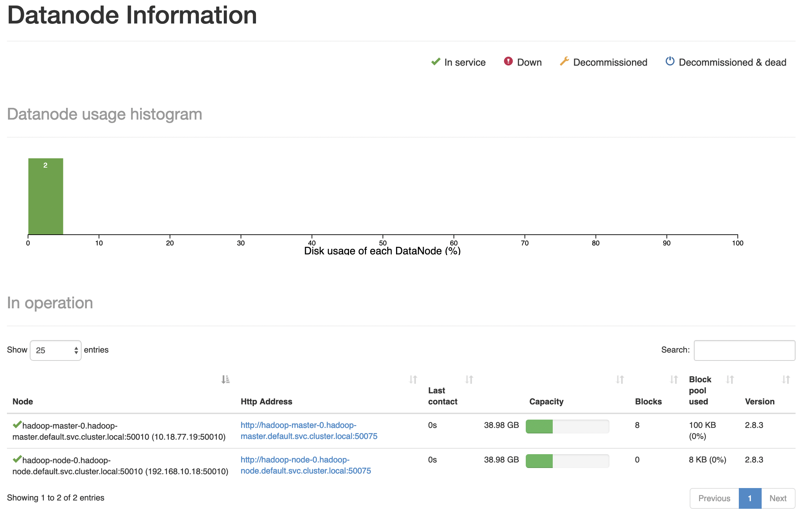
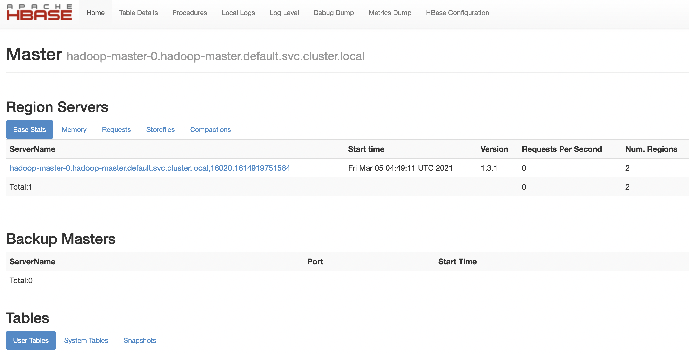

# k8s hadoop simple cluster

use image [izone/hadoop](https://hub.docker.com/r/izone/hadoop/)

cluster/cluster.sh [origin](https://github.com/luvres/hadoop/blob/master/cluster/cluster.sh)

datanode/start.sh [origin](https://github.com/luvres/hadoop/blob/master/cluster/datanode/start.sh)

## images

### datanode

cd ../datanode

docker build -t hadoop:2.8.3-datanode ./

docker build --build-arg http_proxy= --build-arg https_proxy= -t cclient/hadoop:2.8.3-datanode ./

### namenode

cd ../cluster

docker build -t hadoop:2.8.3-cluster ./

docker build --build-arg http_proxy= --build-arg https_proxy= -t cclient/hadoop:2.8.3-namenode ./

## deploy

datanode must have started before deploy namenode(namenode ssh datanode to config)

### datanode

kubectl apply -f deploy-datanode.yml

### namenode

kubectl apply -f deploy-namenode.yml

## show

```bash
$ kubectl get pods
NAME              READY   STATUS    RESTARTS   AGE
hadoop-master-0   1/1     Running   0          10h
hadoop-node-0     1/1     Running   0          10h

$ kubectl get svc
NAME            TYPE        CLUSTER-IP      EXTERNAL-IP   PORT(S)                                                                                                                                                                  AGE
hadoop-master   NodePort    10.99.224.121   <none>        22:32620/TCP,8088:32688/TCP,8042:30120/TCP,50030:32630/TCP,50070:32670/TCP,8888:32488/TCP,4040:32029/TCP,8787:31379/TCP,9000:30074/TCP,60010:32510/TCP,60030:32530/TCP   12h
hadoop-node     ClusterIP   10.107.83.73    <none>        22/TCP                                                                                                                                                                   12h
kubernetes      ClusterIP   10.96.0.1       <none>        443/TCP                                                                                                                                                                  8d
```


## view demo

### hadoop

cluster http://k8s-node-ip:32688



namenode  http://k8s-node-ip:32670



### hbase

hbase-master http://k8s-node-ip:32510



hbase-regionserver http://k8s-node-ip:32530


### jupyter
notebook http://k8s-node-ip:32488
